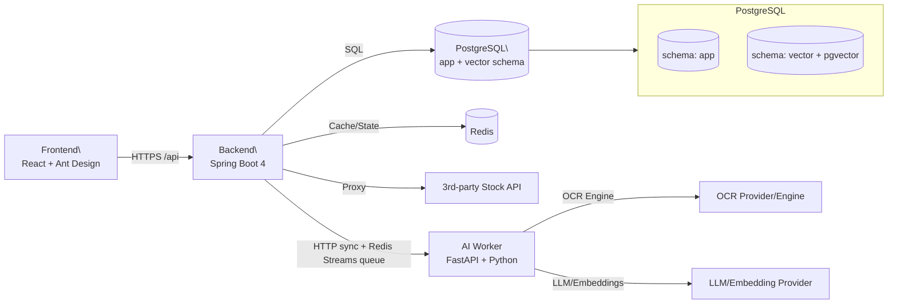

# 專案架構書（投資助理平台）
> 檔名：**專案架構書.md**  
> 版本：v2（目前：React/Vite 前端 + Spring Boot 4 Multi-Module 後端 + Python AI Worker（OCR/RAG ingestion）已導入；回測仍為可選擴充）。
- **MongoDB：目前不需要**（Redis + Postgres(JSONB) 足夠）。

---

## 版本資訊

### Frontend
- **React**: 19.2.0
- **TypeScript**: 5.9.x
- **Vite**: 7.2.x
- **Ant Design**: 6.1.4
- **Router**: React Router DOM 7.12.0
- **State Management**: Zustand 5.0.9
- **HTTP Client**: Axios 1.13.2
- **Monitoring**: Sentry React 10.38.x
- **Testing**: Vitest 4.x + React Testing Library (Unit), Playwright (E2E)

### Backend
- **Spring Boot**: 4.0.1
- **Java**: 21
- **Spring Framework**: 7.0.2 (由 Spring Boot 管理)
- **Spring Data JPA**: (由 Spring Boot 管理)
- **Spring Security OAuth2**: (由 Spring Boot 管理)
- **Swagger/OpenAPI**: SpringDoc 3.0.1
- **JWT**: JJWT 0.13.0
- **PostgreSQL Driver**: (由 Spring Boot 管理)
- **Redis**: Spring Data Redis (由 Spring Boot 管理)
- **Monitoring**: Sentry Java

---

### 2.7 多市場（台股 + 美股）與商品唯一鍵
- 全站商品使用 `instrument_id`（**BIGINT 自增**）作為內部主鍵，對外 API 回傳時轉為字串。
- 商品唯一鍵（對外識別）：`symbol_key = {market}:{exchange}:{ticker}`，例如：`US:XNAS:AAPL`、`TW:XTAI:2330`。
- API 支援雙重查詢：
  - `instrument_id`：數字 ID（如 `1001`）
  - `symbol_key`：字串鍵（如 `US:XNAS:AAPL`）
- 需支援 ticker 變體：如 `BRK.B` vs `BRK-B`，以 `instrument_aliases` 做對照。
- 後端統一存時間為 `UTC`，市場時區只用來算「是否開盤」與前端顯示。

> **設計說明：** 選擇 BIGINT 而非 UUID 的原因：
> - 效能優勢：索引/Join 效率更高（8 bytes vs 16 bytes）
> - 自然排序：自增序列天然按時間排序
> - 可讀性佳：易於 debug 與人工查詢
> - 單一資料庫：不需要 UUID 的全域唯一性
> - `symbol_key` 已提供跨市場唯一識別能力

### 2.8 幣別/匯率與資產顯示基準
- 只要納入美股，就會出現多幣別（TWD/USD）資產；必須引入 `fx_rates`。
- 使用者設定 `base_currency`（預設 TWD）；資產總覽一律換算到 base currency。
- 報酬可拆成：**標的漲跌貢獻** vs **匯率貢獻**（進階，可後做）。

### 2.9 公司行為（Corporate Actions）
- 至少要處理：**拆股/併股（split）**，否則持倉股數與平均成本會失真。
- 進階可加：股利（dividend）、ticker 更名（rename）、合併/分拆（merger/spinoff）。

### 2.10 即時串流選型（SSE 優先，WS 後補）
- AI 文字串流維持 SSE（穿透性好、實作簡單）。
- 若未來要做到「聊天室雙向互動 / 多人協作 / 盤中推播」再導入 WebSocket（需處理握手鑑權、心跳、重連）。

### 2.11 Python AI Worker（目前已導入於 OCR / RAG Ingestion）
> 定位：**不改變主線 Java 架構**，把「影像/文件/批次資料處理」抽成獨立服務，讓 OCR 與 RAG ingestion 更容易做到穩定且高品質。

**目前使用場景與可擴充方向**
- 已導入：OCR 解析（含影像/PDF 輸入、Vision LLM fallback/provider 切換）
- 已導入：RAG ingestion/query（PDF/HTML/Docx 清理、chunking、embedding、去重與重試）
- 可選擴充：股票分析/回測，大量歷史資料的指標計算與回測（pandas/numpy 生態更省時）

**服務介面（建議）**
- `POST /ocr`：輸入 image/pdf（或 file_id / presigned url）→ 回傳 `raw_text + parsed_json + confidence`
- `POST /ingest`：輸入文件（或 file_id）→ 執行 parse/chunk/embed → 寫入 pgvector（或回傳 chunks 交由後端寫入）
  - **v1.3**：超量時可依 `INGEST_REJECT_ON_LIMIT` 設定回傳 429（`IngestRateLimitError`）
- `POST /query`：RAG 問答端點
  - **v1.3**：Query 端新增 embedding retry/backoff 機制（指數退避 + jitter）
- `POST /backtest`（可選擴充）：輸入策略參數 → 回傳績效摘要/曲線資料

#### 2.11.1 AI Worker Provider 切換（Embedding / OCR）
目標：**一鍵切換 LLM / Embedding / OCR Provider**，不中斷主線流程。

**環境變數（ai-worker `.env`）**
- `LLM_PROVIDER`：聊天 / OCR Vision 使用的 LLM（`gemini` / `openai` / `ollama`）
- `EMBEDDING_PROVIDER`：向量模型來源（`gemini` / `openai` / `ollama`）
- `OCR_PROVIDER`：OCR 來源（`auto` / `tesseract` / `gemini` / `openai` / `ollama`）
- `EMBEDDING_EXPECTED_DIMENSION`：向量維度的硬性檢查（**必填**）

**切換示例**
- 只換 Embedding（LLM/OCR 繼續 Gemini）：
  - `LLM_PROVIDER=gemini`
  - `EMBEDDING_PROVIDER=ollama`
  - `EMBEDDING_EXPECTED_DIMENSION=768`（對應 `nomic-embed-text`）
- 只換 OCR（LLM 仍用 Gemini）：
  - `OCR_PROVIDER=tesseract`（只走本機 OCR，不走 Vision）

**注意**
- `EMBEDDING_EXPECTED_DIMENSION` 必須與實際模型維度一致，否則 ai-worker 會在啟動時 fail-fast。
- 若改用其他 embedding 模型，需同步確認 DB `vector(n)` 維度是否一致。

**與後端互動方式（兩種都可）**
1) **同步（最簡單）**：Backend 直接呼叫 ai-worker（適合小檔/短任務）
2) **非同步（更穩）**：Backend 建立 `ocr_jobs/ingest_jobs` → 丟 Redis Streams（`ocr:queue`/`ingest:queue`）→ ai-worker 消費 → 回寫 Postgres + 更新 job 狀態

#### 2.11.2 密碼保護 PDF OCR（後端已實作，前端待接）
> 定位：支援使用者已知密碼的 PDF 對帳單。系統不破解 PDF；密碼只用於當次授權開啟 PDF，AI 只讀取已開啟後的內容。

**核心原則**
- 使用者知道 PDF 密碼並主動輸入。
- Backend 驗證 file/job/user 權限後，才把密碼交給 AI Worker。
- AI Worker 使用密碼開啟 PDF，執行文字抽取、頁面渲染、OCR 或 Vision LLM。
- 密碼不保存、不進 DB、不進 Redis Stream、不進 log、不進 AI prompt。
- OCR 結果仍走 Draft → Review → Confirm；使用者確認前不寫入正式交易。

**建議狀態**
- `QUEUED`
- `PASSWORD_REQUIRED`
- `PASSWORD_INVALID`
- `RUNNING`
- `FAILED`
- `DONE`
- `CANCELLED`

**MVP 流程**
1. 使用者上傳 PDF 並建立 OCR Job。
2. AI Worker 或 Backend 觸發 PDF 檢查。
3. 未加密 PDF：照既有 OCR queue 流程處理。
4. 加密 PDF 且未提供密碼：job 改為 `PASSWORD_REQUIRED`，等待使用者輸入密碼。
5. 前端顯示密碼 Modal。
6. 使用者提交密碼到 Backend。
7. Backend 驗證 job/file/user 權限。
8. Backend 將密碼放入短效 memory vault（預設 TTL 5 分鐘），job 改回 `QUEUED` 並重新加入 `ocr:queue`。
9. Queue Worker claim job 後，從 memory vault 取用一次密碼並立即移除，再呼叫 AI Worker。
10. 密碼正確：job 改 `RUNNING`，處理完成後 `DONE` 並產生草稿。
11. 密碼錯誤：job 改 `PASSWORD_INVALID`，前端提示重新輸入。

**安全規則**
- 不保存 PDF 密碼到 PostgreSQL、Redis、檔案、log 或 queue message。
- 密碼只短暫存在單一 Backend JVM memory，預設 `APP_OCR_PDF_PASSWORD_TTL=5m`；服務重啟或 TTL 到期後需請使用者重新輸入。
- log 僅可記錄 `passwordProvided=true/false`，不可記錄真實密碼或長度。
- 錯誤訊息不可包含使用者輸入的密碼。
- 暫存圖片或解密中間檔處理完必須刪除；MVP 優先使用 memory bytes，避免產生解密 PDF。
- 若服務重啟導致處理中斷，使用者重新輸入密碼即可。

**未來展望**
- 短效加密保存：用 server-side key 加密保存短時間，支援較大型非同步處理。
- 錯誤密碼次數限制與冷卻時間。
- 加密 PDF 支援延伸到 RAG ingestion，但仍遵守密碼不落地原則。


### 2.12 OCR 解析策略（規則主導 + LLM 備援）
> **定位：** 提升 OCR 準確率、降低 token 成本與等待時間；目前採用「PDF 文字層 + deterministic parser 優先，Vision/Text LLM 備援」策略。

**核心概念：**
- **PDF 文字層優先**：加密 PDF 解密後先用 `pypdf` 抽取每頁文字層。
- **頁面分類**：總覽/說明頁跳過 Vision；交易頁保留文字層並可補跑 Vision；無文字層或不確定頁才走 Vision。
- **deterministic parser**：優先解析券商交易明細區塊，支援 Markdown table、pipe table、PDF 文字層直式區塊。
- **合計驗證**：以成交金額、手續費、代繳交易稅合計驗證完整性。
- **LLM 備援**：只有規則解析不足或合計不一致時，才呼叫 Gemini/Text LLM parser。

**設計原則：**
1. **不自動確認**：無論信心分數多高，全部進入 Review 頁面由使用者確認
2. **規則優先**：穩定券商格式以 deterministic parser 為主，避免 LLM JSON 格式錯誤造成空結果
3. **成本控制**：文字層可解析且合計通過時，不呼叫 Gemini parser
4. **完整追溯**：raw_text、warnings、confidence 與 parser fallback 訊息需保留，供 Review 與除錯

**適用場景：**
- 台股券商月對帳單，例如元大證券電子綜合月對帳單
- 一筆交易拆兩列：成交日/交割日分離、股票代號/名稱分離
- PDF 文字層直式輸出：日期、市場幣別買賣、代號、名稱、數量價格分行
- Vision OCR 偶發截斷或 Gemini parser JSON 格式錯誤

**成本對比：**
- PDF 文字層 + deterministic parser：近似 0 token，秒級完成
- Vision OCR：僅用於無文字層或需補強的交易頁
- Text LLM parser：僅在規則解析不足/合計不一致時備援

**實作階段：**
- **已實作**：密碼 PDF、PDF 文字層抽取、逐頁 Vision、交易頁文字層保留、deterministic parser、合計驗證。
- **已實作 parser 格式**：Markdown table、無首尾 `|` 的 pipe table、PDF 文字層直式交易區塊。
- **未來展望**：A/B 差異可視化、區塊裁切 Vision、更多券商格式 parser。


---

## 3. 系統總體架構

### 3.1 架構圖（邏輯）


### 3.2 核心資料流
1. **登入（雙入口）**：
   - Google OAuth：Google → Backend 驗證 → 建/找 user → 發 access/refresh。
   - Admin 本地登入：`/api/auth/admin/login`（email/password）→ Argon2id 驗證 + rate limit/鎖定/稽核 → 發 access/refresh。
2. **交易/持股**：Trade（BUY/SELL）→ 重新計算 Position（avg_cost/qty）→ Portfolio/Chart。
3. **圖表**：Backend 代理股票 API + Redis 快取 → 前端畫圖；疊加成本線/買賣點。
4. **OCR 匯入（規則主導；密碼 PDF 後端支援已實作）**：
   - Upload → OCR Job → AI Worker 抽 PDF 文字層 / 頁面分類 / Vision fallback
   - → deterministic parser + 合計驗證 → Review UI → Confirm → 入帳 trades/positions
   - 若 PDF 需要密碼：OCR Job 先進 `PASSWORD_REQUIRED`，使用者輸入密碼後才繼續處理；密碼不落地。
5. **AI 分析（SSE）**：行情摘要 + 持股成本 → LLM → SSE 串流 → 可存 report。
6. **RAG**：快照/筆記/報告 → chunk + embedding → pgvector → Chat 檢索 + citations。
7. **ETF 支援（v1.2）**：ETF 與股票共用交易流程，商品主檔標記 `asset_type=ETF`，可關聯 `etf_profiles` 顯示標的資訊。
8. **權證支援（v1.4）**：商品主檔標記 `asset_type=WARRANT`，權證基本資料存 `warrant_profiles`（underlying_symbol/expiry_date）；來源為 TPEx OpenAPI（`/tpex_warrant_issue`）+ TWSE ISIN fallback。
   - **TPEx OpenAPI（權證相關）**（來源：https://www.tpex.org.tw/openapi/）
     - `/tpex_warrant_issue`：上櫃權證發行基本資料（**基本資料主來源**）
     - `/tpex_warrant`：上櫃股票權證資訊（名冊/參考）
     - `/tpex_warrant_daily_quts`：上櫃權證收盤行情日報表
     - `/tpex_warrant_monthly_quts`：上櫃權證收盤行情月報表
     - `/tpex_warrant_quts`：單筆權證成交資料
     - `/tpex_warrant_statistics`：每日權證交易人數
     - `/tpex_warrant_suspend_today`：當日暫停/恢復交易資訊
     - `/tpex_warrant_suspend_history`：歷史暫停/恢復交易資訊
     - `/tpex_warrant_gold`：黃金現貨權證發行基本資料
     - `/tpex_warrant_gold_quts`：黃金現貨權證收盤行情
     - `/tpex_warrant_wcb_issue`：上櫃牛熊證發行基本資料（不含展延型）
     - `/tpex_warrant_wcb_daily_quts`：上櫃牛熊證收盤行情日報表（不含展延型）
     - `/tpex_warrant_wcb_monthly_quts`：上櫃牛熊證收盤行情月報表（不含展延型）
     - `/tpex_warrant_wxy_issue`：上櫃展延型牛熊證發行基本資料
     - `/tpex_warrant_wxy_daily_quts`：上櫃展延型牛熊證收盤行情日報表
     - `/tpex_warrant_wxy_monthly_quts`：上櫃展延型牛熊證收盤行情月報表
     - `/mopsfin_t187ap37_O`：上櫃權證基本資料彙總表
     - `/mopsfin_t187ap42_O`：上櫃認購(售)權證每日成交資料檔
     - `/mopsfin_t187ap36_O`：上櫃認購(售)權證年度發行量概況統計表

---

## 4. 後端：Maven Multi-Module（功能分 module）

### 4.1 模組清單與責任
- `app-bootstrap`：啟動/組裝（最終打包成一個後端應用）。
- `app-api`：Controller、API DTO/VO、全域錯誤處理、Swagger/OpenAPI。
  - **InstrumentController**（v1.1 補充）：商品主檔查詢
    - `/instruments` - 商品列表（分頁）
    - `/instruments/search` - 搜尋商品（自動補全）
    - `/instruments/{symbolKey}` - 商品詳情
  - **StockController**：股票行情、市場/交易所列表、Tickers 查詢
  - **AdminPortfolioController**（v1.5 補充）：`POST /admin/portfolios/positions-rebuild`，提供持倉修復重算
- `app-auth`：Google OAuth + Admin 本地登入（Argon2id）、JWT/Session、安全設定、`users` 維護。
- `app-portfolio`：交易/持股核心（trades、positions、watchlist）。
- `app-stocks`：股票 API proxy + **商品主檔（markets/exchanges/instruments/aliases）** + Redis cache + rate limit。
  - **InstrumentService**：商品主檔 CRUD（search、findBySymbolKey、findById）
  - **StockTickerService**（v1.1 補充）：台股 Ticker 列表查詢（支援 EQUITY/INDEX/ETF 分類）
  - **StockQuoteService**：即時報價與 K 線資料（含快取）
  - **AlpacaClient / FugleClient**：美股/台股資料源適配器
  - **InstrumentService**：商品主檔 CRUD（search、findBySymbolKey、findById）
  - **StockTickerService**（v1.1 補充）：台股 Ticker 列表查詢（支援 EQUITY/INDEX/ETF 分類）
  - **InstrumentSyncService**：管理員同步商品/權證（TPEx + TWSE fallback）
  - **WarrantProfileService**：權證基本資料寫入/查詢
  - **StockQuoteService**：即時報價與 K 線資料（含快取）
  - **AlpacaClient / FugleClient**：美股/台股資料源適配器
- `app-ocr`：OCR jobs、結果、draft trades、匯入交易（呼叫 portfolio service）。
  - **OcrService**：草稿驗證採 **Validator Chain**（可擴充規則、不影響主流程）。
  - **OcrJobProcessor**：OCR job 執行與狀態轉換（讀檔、呼叫 AI worker、寫入草稿）。
  - **PDF 密碼支援（後端已實作，前端待接）**：管理 `PASSWORD_REQUIRED/PASSWORD_INVALID` 狀態；提交密碼 API 只在當次 request memory 使用密碼，不進 Redis Stream。
  - **OcrDraftService**：草稿建立與驗證鏈整合（row_hash、warnings/errors）。
  - **OcrFileService**：讀取上傳檔案內容（local provider）。
    - 阻擋：statement 內重複草稿（同 `row_hash`）
    - 錯誤：必填欄位缺失（tradeDate/side/quantity/price/currency）
    - 警告：交割日早於成交日、既有交易重複、幣別不一致、交易日落在未來
- `app-files`：檔案上傳與 Object Storage（local/S3/MinIO）、`files` 表與權限（signed URL/中轉）。
- `app-ai`：SSE 串流、分析/報告、Prompt 管理。
- `app-ai`（Chat）：instrument 查詢走 DB 工具（非向量化），避免幻覺；並加 Caffeine 快取（TTL 可調）。
  - 工具觸發為後端預處理：先找 `instrument_candidates`，再視關鍵字補 `quote`，LLM 不直接呼叫 `/api/stocks/quote`。
  - token 擷取優先序：`symbolKey`（含 URL query 的 `symbolKey=...`）→ 數字 ticker（如 `2330`）→ 英文 token → 中文 token（去除停用詞）。
  - 代詞 fallback：本輪查不到標的且命中「這隻/這檔/它/他/她/這個/那個」時，先讀 `lastMentionedSymbolKey` 快取，未命中才回看最近 user 訊息（預設 5 筆，可調）。
  - 非代詞但報價意圖（命中 quote keywords）時，本輪無候選會只嘗試 `lastMentionedSymbolKey`，不做回溯掃描。
  - quote 結果會附 `tool_quote_available/tool_quote_error`，並在 `tool_quote_available=true` 時要求模型必須直接使用報價數值作答。
  - `lastMentionedSymbolKey` 使用 Caffeine（key=`{userId}:{conversationId}`，TTL 預設 12h）。
- `app-rag`：chunk/embedding、向量寫入、TopK 檢索、citations。
- `app-common`：跨模組穩定共用（ApiResponse、ErrorCode、BusinessException、Clock/Id…）。
- `app-persistence`：DB/transaction、MyBatis/JPA 設定、type handlers、migration 配置。

### 4.2 介面抽象（Ports & Adapters）
> 抽成介面以低耦合、可替換供應商/實作。

建議必抽的 Port：
- `StockMarketClient`（股票資料來源）
- `OcrEngine`（OCR 引擎）
- `LlmClient`（LLM 分析/結構化）
- `EmbeddingClient`（Embedding）
- `VectorStore`（向量儲存/檢索）
- `ObjectStorage`（上傳檔案儲存：local/S3/MinIO）
- `FxRateProvider`（匯率來源：USD/TWD…）
- `CorporateActionProvider`（公司行為來源：拆股/股利/更名…）
- `CacheService/RateLimiter`（Redis 快取/限流）
- `CurrentUserProvider`（取得當前 user，隔離 Spring Security 細節）
- `ClockProvider/IdGenerator`（測試友善）


（新增）若導入 **ai-worker（Python）**，建議的 Adapter 對應：
- `OcrEngine` → `AiWorkerOcrAdapter`（呼叫 ai-worker `/ocr`；或由 ai-worker 直接呼叫雲端 OCR）
- `EmbeddingClient` → `AiWorkerEmbeddingAdapter`（批次 embedding/入庫）或維持由後端直連 embedding provider
- `VectorStore`：兩種擇一（**二選一即可**）
  - A) 後端寫入 pgvector（ai-worker 回傳 chunks + embeddings）
  - B) ai-worker 直接寫 pgvector（後端只管 job/metadata）


---

## 5. Repo 與後端資料夾結構（目前實際落地）

> 目前 repo 採 monorepo 形式；後端仍維持 Maven Multi-Module，AI Worker 與 Frontend 放在 `apps/` 下。

```text
stock_assistant/
├─ README.md
├─ docs/
│  ├─ 01_專案架構書.md
│  ├─ 04_API_合約.md
│  └─ ...
├─ apps/
│  ├─ frontend/
│  │  ├─ package.json
│  │  ├─ vite.config.ts
│  │  └─ src/
│  ├─ ai-worker/
│  │  ├─ Dockerfile
│  │  ├─ app/
│  │  └─ tests/
│  └─ backend/
│     └─ invest-assistant-backend/
│        ├─ Dockerfile
│        ├─ compose.yaml
│        ├─ pom.xml
│        └─ modules/
│           ├─ app-bootstrap/
│           ├─ app-api/
│           ├─ app-auth/
│           ├─ app-portfolio/
│           ├─ app-stocks/
│           ├─ app-ocr/
│           ├─ app-files/
│           ├─ app-ai/
│           ├─ app-rag/
│           ├─ app-common/
│           └─ app-persistence/
```

---

## 6. 技術選型（資料存取層）
- 建議組合：**JPA（auth/users） + MyBatis-Plus（大量 CRUD/分頁） + 手寫 SQL（pgvector/JSONB 深度查詢）**
- 也可全 MyBatis-Plus（更一致），但 auth 需自行把 security glue 寫完整。

---

## 7. Entity / DTO / VO / Enum 放置規範（乾淨做法）

### 7.1 放置原則
- **Entity**：放在各自功能 module（不要丟到 common）。
- **API DTO/VO**：放 `app-api`（做為對外合約 contract）。
- **模組內部 Command/Query/DTO**：放各自 module（application 層）。
- **跨模組穩定共用**：放 `app-common`（如 ErrorCode、ApiResponse、ClockProvider…）。

### 7.2 Enum 最乾淨的做法
- **DB 永遠存字串 code（EnumType.STRING / varchar）**，不要存 ordinal。
- enum 只負責 code（狀態/類型），**不要放顯示文字**。
- UI 顯示（label/i18n）在前端處理（或 dictionary mapping）。
- enum 放在「擁有語意」的 module；跨模組才放 common（例如 `ErrorCode`）。

---

## 8. 全域回傳 / 全域錯誤 / Swagger（放置與規範）

### 8.1 全域回傳格式
- `app-common`：`ApiResponse<T>`, `PageResponse<T>`
- `app-api`：可選 `ResponseBodyAdvice` 自動包裝（**需排除 SSE、檔案下載**）

### 8.2 全域錯誤處理
- `app-common`：`BusinessException`, `ErrorCode`
- `app-api`：`@RestControllerAdvice`（`GlobalExceptionHandler`）

### 8.3 Swagger / OpenAPI
- 建議使用 **springdoc-openapi**
- 放在 `app-api`：

### 8.4 API 合約維護規範
- **任何 API 變更**（新增/修改/刪除）必須同步更新 `docs/04_API_合約.md`。
- 合約需完整列出：
  - Path/Method/說明/Auth
  - **Path/Query/Header/Body** 參數（必填/可選）
  - 預設值、格式（日期/時間/enum/數字精度）
  - 回傳格式（JSON/SSE/檔案）與錯誤碼
  - 至少一組 request/response 範例
- 若後端已支援但合約缺失，視同 **文件 bug** 必須補齊。
  - OpenAPI 設定
  - 分組（auth/portfolio/stocks/ocr/ai/rag）
- SSE endpoint 可標註或從 UI 分組中適當處理（避免 UI 誤導）。

---

## 9. 資料庫設計概覽（PostgreSQL）

### 9.1 Schema
- `app`：業務資料
- `vector`：向量資料（pgvector extension）

### 9.2 多市場（台股 + 美股）主檔（必備）
- `app.markets`：`id`, `code(US/TW)`, `name`, `timezone`, `default_currency`
- `app.exchanges`：`id`, `market_id`, `mic`（如 XNAS/XNYS）, `code`, `name`
- `app.instruments`：
  - `id` (BIGINT IDENTITY，內部主鍵，對外轉字串)
  - `market_id`, `exchange_id`
  - `ticker`（AAPL/2330/00926）, `symbol_key`（US:XNAS:AAPL/TW:XTAI:00926，唯一鍵）
  - `name_zh`, `name_en`, `currency(USD/TWD)`, `status(ACTIVE/DELISTED/SUSPENDED)`, `created_at`, `updated_at`
  - `asset_type`（STOCK/ETF/WARRANT，v1.4 新增 WARRANT）
- `app.instrument_aliases`：`id`, `instrument_id`, `source`, `alias_ticker`（BRK.B/BRK-B…）, `created_at`
- `app.etf_profiles`（v1.2 新增）：
  - `instrument_id` (PK/FK)
  - `underlying_type`（INDEX/THEMATIC/FACTOR/ACTIVE/OTHER）
  - `underlying_name`（如「S&P 500 Index」、「全球AI×智能電動車」）
  - `as_of_date`, `updated_at`
- `app.warrant_profiles`（v1.4 新增）：
  - `instrument_id` (PK/FK)
  - `underlying_symbol`, `expiry_date`

> 建議 trades/positions 都只存 `instrument_id`；`symbol_key`/`ticker` 只當顯示或快取欄位。  
> 對外 API 回傳時 `instrument_id` 轉為字串，支援 `instrument_id` 或 `symbol_key` 雙重查詢。

### 9.3 行情與匯率
- `app.prices`：`instrument_id`, `ts_utc`, `time_interval(1d/1h/1m...)`, `open/high/low/close/volume`, `source`
- `app.fx_rates`：`base_currency`, `quote_currency`, `ts_utc`, `rate`（例如 base=TWD, quote=USD）

### 9.4 交易/持倉（Portfolio）
- `app.users`：`id`, `google_sub(unique, nullable)`, `email`, `password_hash(nullable)`, `role(USER/ADMIN)`, `display_name`, `picture_url`, `status`, `last_login_at`, `created_at`, `updated_at`
- `app.user_settings`：`user_id(PK)`, `base_currency`, `display_timezone`, `created_at`, `updated_at`
- `app.portfolios`：`id`, `user_id`, `name`, `base_currency`, `created_at`, `updated_at`
- `app.accounts`（可選，支援多券商）：`id`, `portfolio_id`, `name`, `broker`, `currency`, `created_at`, `updated_at`
- `app.stock_trades`：
  - `id`, `user_id`, `portfolio_id`, `account_id(optional)`, `instrument_id`
  - `trade_date`, `settlement_date`, `side(BUY/SELL)`, `quantity`, `price`, `currency`
  - `gross_amount`, `fee`, `tax`, `net_amount`
  - `source(OCR/MANUAL/API/MIGRATION)`, `source_ref_id`, `row_hash(unique)`
- `app.user_positions`（快取表）：
  - `portfolio_id`, `instrument_id`（複合主鍵）
  - `total_quantity`, `avg_cost_native`, `currency`, `updated_at`
- `app.cash_ledger`（可選）：`id`, `user_id`, `portfolio_id`, `account_id`, `ts_utc`, `currency`, `amount`, `entry_type`, `ref_trade_id`, `meta`
- `app.portfolio_valuations`（可選）：`portfolio_id`, `as_of_date`, `base_currency`, `total_value`, `cash_value`, `positions_value`

### 9.5 公司行為（Corporate Actions）
- `app.corporate_actions`：`id`, `instrument_id`, `action_type(SPLIT/DIVIDEND/RENAME/...)`, `ex_date`, `effective_date`, `payload(jsonb)`
- **MVP 最少要先做 SPLIT**：`payload` 內含 `ratio_from`, `ratio_to` 或 `split_ratio`。

### 9.6 OCR / AI 報告 / 檔案
- `app.files`：`id`, `user_id`, `provider(local/s3/minio)`, `bucket`, `object_key`, `sha256`, `size_bytes`, `content_type`, `created_at`
  - **唯一性約束（v1.1 V5）**：`UNIQUE (user_id, sha256)` - per-user 去重，不同使用者可上傳同一檔案
- `app.ocr_jobs`：`id`, `user_id`, `file_id(FK)`, `statement_id`, `status(QUEUED/PASSWORD_REQUIRED/PASSWORD_INVALID/RUNNING/FAILED/DONE/CANCELLED)`, `progress`, `error_message`, `created_at`, `updated_at`
  - 密碼 PDF 不新增密碼欄位；不得存 `password`、`decrypted_pdf_path`、`decrypted_content`。
- `app.ai_reports`：`id`, `user_id`, `instrument_id`, `report_type(INSTRUMENT/PORTFOLIO/GENERAL)`, `input_summary(jsonb)`, `output_text`, `created_at`

> **注意**：OCR 結果與交易草稿統一使用 **9.6.1 匯入 Staging** 管線（`statements` + `statement_trades`），不再使用獨立的 `ocr_results` / `ocr_draft_trades` 表。

#### 9.6.1 匯入 Staging（OCR / 手動輸入共用一條管線）
> 目的：先存「草稿」，讓使用者在 Review 頁校對；Confirm 後才寫入 `stock_trades` 並更新 `user_positions`（可追溯、可去重、可重跑）。

- `app.statements`：一份匯入批次（source=OCR/MANUAL），關聯 `file_id`（OCR 才有）
- `app.statement_trades`：匯入的交易列（含 `row_hash`、`errors_json/warnings_json`）
  - **v2 新增（雙路徑解析）**：
    - `parsed_a_json` (JSONB)：Text LLM 解析結果
    - `parsed_b_json` (JSONB)：Vision LLM 解析結果（可選）
    - `final_json` (JSONB)：融合後的最終草稿
    - `diff_json` (JSONB)：A、B 差異清單（欄位級別）
    - `confidence_a` (NUMERIC)：A 路徑信心分數（0.0-1.0）
    - `confidence_b` (NUMERIC)：B 路徑信心分數（0.0-1.0）
    - `merge_rule_version` (TEXT)：融合規則版本（追溯用）
- `app.statement_holdings`：匯入的庫存列（對帳/比對用，v1 可不影響 positions）
- `app.statement_dividends`（可選）：股利列（或併入 `corporate_actions`）

**建議把 OCR 與手動輸入都做成：**
- Parse → 寫入 statement_*（DRAFT）
- Review → 使用者可修改（仍在 statement_*）
  - **v2 增強**：差異欄位標紅，提供「套用 A / 套用 B」按鈕
- Confirm → 寫入正式交易表 + 更新 positions（並把 statement 標記 CONFIRMED）

**草稿驗證（Validator Chain）**
- 設計目標：規則可插拔、單一職責、避免 `saveDrafts()` 膨脹。
- 阻擋規則：同一 statement 內重複草稿（`row_hash`）。
- 錯誤規則：必填欄位缺失（`trade_date/side/quantity/price/currency`）。
- 警告規則：交割日早於成交日、既有交易重複、幣別不一致、交易日落在未來。

**OCR 解析流程（目前已實作）：**
```
Upload → files
    ↓
OCR Job → ocr_jobs (QUEUED → RUNNING)
    ↓
AI Worker
    ├─→ PDF text layer（pypdf）
    ├─→ page classifier（總覽頁跳過；交易頁保留文字層 + 可補 Vision）
    ├─→ Vision OCR fallback（無文字層 / 不確定頁 / 交易頁補強）
    └─→ raw_text merge
    ↓
deterministic parser
    ├─→ 只解析「上市、上櫃、興櫃交易明細」區塊
    ├─→ Markdown table / pipe table / vertical text-layer blocks
    └─→ 合計驗證（成交金額 / 手續費 / 代繳交易稅）
    ↓
    ├─ 合計通過 → final_json
    └─ 合計不一致 → Text LLM parser fallback；失敗時回退規則結果 + warnings
    ↓
statement_trades (DRAFT)
    ↓
Review UI（warnings / confidence / 使用者確認）
    ↓
Confirm → stock_trades + user_positions
```

**密碼保護 PDF OCR 流程（後端已實作，前端待接）：**
```
Upload PDF → files
    ↓
OCR Job → ocr_jobs (QUEUED)
    ↓
PDF 加密檢查
    ├─ 未加密 → RUNNING → OCR/Parse → DRAFT
    └─ 需密碼 → PASSWORD_REQUIRED
                    ↓
                前端輸入密碼
                    ↓
                Backend 驗證 job/file/user 權限
                    ↓
                短效 memory vault + 重新 enqueue
                    ↓
                Queue Worker 取用一次密碼並呼叫 AI Worker
                    ├─ 密碼錯誤 → PASSWORD_INVALID
                    └─ 密碼正確 → RUNNING → OCR/Parse → DRAFT
```

**密碼處理規範：**
- 密碼不得寫入 `ocr_jobs`、Redis Stream、`statements.raw_text`、`statement_trades.*_json`、log 或 AI prompt。
- `/password` 端點不得同步等待 OCR 完成；只負責存入短效 memory vault、requeue job，前端透過 polling 等待最終狀態。
- Queue message 只允許放 `jobId/userId/fileId` 等非敏感識別資訊。
- `PASSWORD_INVALID` 的 `error_message` 使用通用文字，例如「PDF 密碼錯誤，請重新輸入」。
- AI Worker 只回傳錯誤碼與解析結果，不回傳密碼相關細節。

#### 9.6.2 民國日期（ROC）自動轉西元（AD）規範
- DB 一律存 **西元 `DATE` / `TIMESTAMP`**（ISO）
- 匯入解析時支援：
  - `YYYYMMDD`（西元 8 碼）
  - `YYYMMDD`（民國 7 碼，西元年 = 民國年 + 1911）
  - `YYYMM`（民國 5 碼）→ v1 可自動補日 `01`，並寫入 `warnings_json`


向量表（`vector`）：
- `vector.rag_documents`：`id`, `user_id`, `source_type`, `source_id`, `title`, `meta(jsonb)`, `created_at`
- `vector.rag_chunks`：`id`, `document_id`, `user_id`（冗餘，提升查詢效率）, `chunk_index`, `content`, `embedding vector(1536)`, `meta(jsonb)`, `created_at`

> 向量資料務必帶 `user_id`，避免檢索到他人資料。

### 9.7 索引與唯一性（建議）
- `instruments(symbol_key)` unique
- `prices(instrument_id, time_interval, ts_utc)` unique
- `fx_rates(base_currency, quote_currency, ts_utc)` unique
- `instrument_aliases(source, alias_ticker)` unique
- `stock_trades(row_hash)` unique
- `rag_chunks(document_id, chunk_index)` unique
- `rag_chunks(user_id)` index（向量檢索過濾）

---

## 10. Redis 使用策略（短期與快取）
> 補充：Chat 的 `conversationLastMentioned` 為應用內 Caffeine 快取，不放 Redis。

### 10.1 行情快取（cache）
- Quote：`quote:{symbolKey}`（預設 TTL：`stock.cache.quote-ttl=300000`，即 5 分鐘）
- Candles：`candles:{symbolKey}:{interval}:{from}:{to}`（預設 TTL：`stock.cache.candles-ttl=3600000`，即 60 分鐘）

### 10.2 Rate limit
- **Auth refresh**：`SimpleRateLimiter`（IP 維度，配置 `app.auth.refresh.rate-limit` / `app.auth.refresh.rate-window`）
- **外部行情 API**：`ExternalApiRateLimiter`（in-process fixed-window，配置 `stock.rate-limit.*`）
- 觸發限制時回傳 `RATE_LIMITED`，並帶 `vendor/endpoint/limit/windowMs`

### 10.3 OCR/AI Job 狀態（MVP）
- `ocr:job:{userId}:{jobId}`（TTL：24h）
- `ai:job:{userId}:{jobId}`（TTL：24h）

### 10.4 佇列、重試、去重（已落地）
- Queue：Redis Streams `ocr:queue`（consumer group）
- Retry：失敗時 `retry_count + next_run_at`（也可先只做固定次數重試）
- 去重（idempotency）：`ocr:dedupe:{userId}:{fileSha256}`（TTL：7d），避免同檔重送造成重覆入帳
- **Consumer Group 自我修復**：若遇 `NOGROUP` 會自動重建並重試一次；`BUSYGROUP` 視為已存在
- **密碼 PDF 例外（後端已實作）**：需要密碼的 job 不得把明文密碼放入 Redis Stream。使用者提交密碼後，Backend 只存入短效 memory vault、把 job 改回 `QUEUED` 並重新 enqueue；Queue Worker 取用一次密碼後立即移除。


### 10.5 Auth Session（Refresh 存活/撤銷/旋轉）
- `sess:refresh:{jti}`（TTL=refresh 到期時間）：
  - value/hash fields：`userId`, `sessionId(optional)`, `expiresAt`
- （可選）`sess:user:{userId}`（SET）：該使用者所有有效 jti，用於「全裝置登出」
- （可選）`bl:access:{jti}`（TTL=access 到期）：若你要做到「登出立刻讓 access 失效」

### 10.6 Chat 應用內快取（Caffeine）
- `conversationLastMentioned:{userId}:{conversationId}`：最近一次成功解析的 `symbolKey`。
- TTL：`app.ai.chat.last-mentioned.cache-ttl`（預設 `12h`）。
- 代詞回溯視窗：`app.ai.chat.pronoun-lookback.limit`（預設 `5`，上限建議 `10`）。


---

## 11. 前端頁面（MVP 與進階）

### 11.1 MVP（約 10 頁）
1. Landing（首頁）
2. Auth Callback（Google 回跳）
3. Dashboard（總覽）
4. Portfolio（我的持股）
5. Trades（交易列表）
6. Trade Form（新增/編輯交易）
7. Chart（圖表：行情 + 成本線 + 買賣點 + AI）
8. AI Analysis（可做成 Chart 右側面板/抽屜）
9. OCR Upload（上傳）
10. OCR Review（交易草稿編輯/確認匯入）
（可選）Settings

### 11.3 OCR 密碼 PDF UX（前端待接）
- 上傳 PDF 後，若 job 狀態為 `PASSWORD_REQUIRED`，顯示 Modal：「此 PDF 需要密碼，請輸入密碼後繼續處理」。
- 密碼欄位只保留在 component local state；不得存 localStorage、sessionStorage 或長期 Zustand store。
- 送出後顯示「正在解密並解析 PDF」並繼續既有 polling。
- `PASSWORD_INVALID` 顯示「PDF 密碼錯誤，請重新輸入」。
- Modal 關閉、成功或失敗後需清空密碼欄位。

### 11.2 進階（再加）
- Alerts（提醒/警示）
- Snapshots（快照）
- Notes（筆記）
- Chat（RAG 問答）

---

## 12. Docker 部署概覽與 CI/CD 規劃
- 目前 Docker Compose 檔案位置：`apps/backend/invest-assistant-backend/compose.yaml`
- 在 `apps/backend/invest-assistant-backend` 執行 `docker compose up -d` 可啟動：
  - backend
  - postgres（含 pgvector）
  - redis
  - ai-worker（Python FastAPI：OCR / RAG ingestion / RAG query）
- Nginx / HTTPS / 安全 headers 可用獨立反向代理設定補上，不在目前 compose 檔內。
- GitHub Actions（規劃）：
  - CI：build + test
  - Deploy：build image → push registry → SSH 到主機 → `docker compose pull && docker compose up -d`

---

## 13. 里程碑建議（最小可交付）
0) 多市場主檔（markets/exchanges/instruments/aliases）+ `symbol_key` 規範（先把美股納進來）  
1) Google OAuth + Admin 本地登入（Argon2id）+ user_id 隔離 + CORS/Cookie 規範  
2) Trades/Positions（手動新增交易，成本法先用加權平均）  
3) Stocks Proxy + Chart（含成本線/買賣點；時間一律 UTC）  
4) FX 匯率（USD/TWD）+ 資產總覽換算到 base_currency  
5) **ETF 支援（v1.2）**：
   - instruments 加 `asset_type` 欄位
   - 建立 `etf_profiles` 表
   - Frontend 顯示 ETF 標籤與標的資訊
6) **權證支援（v1.4）**：
   - instruments 加 `asset_type=WARRANT`
   - 建立 `warrant_profiles`（underlying_symbol/expiry_date）
   - 管理員同步（TPEx + TWSE fallback）
7) **OCR 匯入（v1.0 Text LLM）**：
   - A 路徑（Text LLM）
   - draft → review → confirm → 入帳
   - 含去重/重試
8) **OCR 匯入（v1.1 密碼保護 PDF，後端已實作，前端待接）**：
   - `PASSWORD_REQUIRED/PASSWORD_INVALID` job 狀態
   - 密碼提交 API
   - AI Worker 支援加密 PDF 開啟與錯誤碼
   - 前端密碼 Modal
   - 密碼不落地、不進 queue
9) **OCR 匯入（v2.0 雙路徑）**：
   - 加入 B 路徑（Vision LLM）
   - 融合層（final + diff + confidence）
   - Review UI 增強（差異標紅、快速通過）
10) AI 解讀（SSE + report 保存）
11) 公司行為（先做 SPLIT）
12) RAG（pgvector）與 Chat（可後做）
13) **投資組合管理（規劃中）**：
   - 重新命名：`PATCH /api/portfolios/{id}`；已有交易後不可變更 `baseCurrency`
   - 刪除：`DELETE /api/portfolios/{id}`，連動刪除 trades/positions/valuations 與 RAG 向量；前端需二次確認、可刪到 0 個（之後走建立流程）
   - 前端入口：投資組合切換器旁的「管理」動作（重新命名/刪除）
   - 詳見 `docs/04_API_合約.md` Portfolio 章節

---

## 14. 附錄：模組間依賴規則（避免環狀）
- `app-api` 只依賴各模組提供的 service（或 application facade）。
- `app-ocr` 匯入交易時，呼叫 `app-portfolio` 的 service（不要直接寫 trades 表）。
- `app-common` 不依賴任何業務模組；業務模組可依賴 `app-common`。
- `app-bootstrap` 依賴全部（組裝）。
- **Build-time 強制**（已落地）：
  - Root `pom.xml` 使用 `maven-enforcer-plugin`，在 `validate` 階段強制 Java/Maven 版本與 module 收斂。
  - `app-api` 的 `ApiArchitectureRulesTest` 禁止依賴 `app-persistence.entity`。
  - `app-common` 的 `CommonArchitectureRulesTest` 禁止依賴任何業務模組。

---

## 15. 安全與跨網域策略（Cookie / CORS / CSRF）
### 15.1 建議的網域切分（避免 Cookie 干擾）
- 前端：`https://app.xxx.com`（或 `https://xxx.com`）
- 後端：`https://api.xxx.com`
- **避免把後端 Cookie 的 Domain 設成過大的範圍**（例如 `.xxx.com`）而影響其他子站；若必須共享登入才設 `.xxx.com`。

### 15.2 Cookie 建議（若你用 cookie-based auth）
- `HttpOnly=true`, `Secure=true`（HTTPS 必開）
- SameSite：
  - 同站（app/api 同 eTLD+1 不跨站）：通常 `Lax` 可行
  - 若遇到跨站 OAuth callback / 第三方嵌入：改 `None` + `Secure`
- Path：把 refresh token cookie 限縮到 `/api/auth/refresh`（降低污染面）

### 15.3 CORS 建議（SPA 常見）
- 允許白名單 origins（不要用 `*` + credentials）
- `allowCredentials=true`（若需要送 cookie）
- SSE：確保 Nginx 不做 buffering（`proxy_buffering off`），並調大 `proxy_read_timeout`。

### 15.4 CSRF（只在你使用 cookie 帶 access token 時需要）
- 建議做法：access token 走 `Authorization: Bearer`；refresh token 才放 cookie（CSRF 風險較可控）。
- 若 access token 也放 cookie：需加 CSRF token（double submit 或 server-side token）。


### 15.5 Token 方案（本次對話定案：Access/Refresh 都放 HttpOnly Cookie + Refresh 狀態落 Redis）
- Cookie：
  - `access_token`：短效（建議 5~15 分鐘），HttpOnly/Secure/SameSite 依網域而定
  - `refresh_token`：長效（建議 7~30 天），HttpOnly/Secure，**Path 限縮到 `/api/auth/refresh`**
- Redis：只存 **refresh token 的 jti（token id）/session 狀態**，用來做撤銷、旋轉與偵測重放（不要把整顆 token 明文存 Redis）
- API：
  - `POST /api/auth/refresh`：使用 refresh cookie 換新 access（並旋轉 refresh）
  - `POST /api/auth/logout`：刪除 cookie + 撤銷 Redis refresh session（可做單裝置或全裝置）

### 15.6 Refresh Rotation（防盜用必做）
- 登入/refresh 成功後都產生新的 refresh（R2），並 **失效舊 refresh（R1）**
- Redis key 建議：`sess:refresh:{jti}`（TTL=refresh 到期）
  - 若 refresh 帶來的 jti 查不到 → 視為過期/撤銷/疑似被盜，用 401 拒絕


---

## 16. 交易與持倉計算規則（含公司行為）
### 16.1 成本法（v1 建議定案：加權平均）
- BUY：`new_qty = old_qty + qty`；`new_avg = (old_avg*old_qty + (price*qty + fee + tax)) / new_qty`
- SELL：`new_qty = old_qty - qty`；avg_cost 不變（實現損益可另算/另存）
- 已提供 `positions rebuild` 修復工具：`POST /api/admin/portfolios/positions-rebuild`（可指定 `instrumentId` 範圍重算）。

### 16.2 公司行為最小支援：拆股（SPLIT）
- 當 `split_ratio = 2:1`：`qty = qty * 2`；`avg_cost = avg_cost / 2`（同幣別下）
- 建議在匯入公司行為後，對受影響標的做一次 positions rebuild。

### 16.3 幣別換算（資產總覽）
- 每個 position 有 native currency（USD/TWD）。
- 顯示時：`value_base = value_native * fx(base_currency <- native_currency)`（匯率使用同日或最近的 ts_utc）。

---

## 17. 檔案儲存（Object Storage）落地
### 17.1 實作選項
- Dev：local filesystem（最簡單）
- Prod：MinIO（自架 S3 相容）或 AWS S3（託管）

### 17.2 File Model（files 表）與引用方式
- 任何上傳檔（OCR 圖片、PDF、報告附件）都先落 `app.files`，其他表只存 `file_id`。
- 以 `sha256` 做去重與追蹤（也可用於 OCR idempotency）。

### 17.3 上傳流程建議
- 最省事：後端提供 upload API（multipart），由後端寫入 storage。
- 更省後端流量：signed URL（前端直傳），後端只做「建立檔案紀錄 + 回寫 object_key」。
- presigned **下載** URL 僅供後端內部使用（RAG ingestion），前端不需要取得。

---

## 18. SSE vs WebSocket（選型與規格）
### 18.1 v1 建議：AI 串流維持 SSE
- 優點：HTTP 友善、穿透性好、前端實作簡單。
- 缺點：單向（server → client），但對「AI 回覆串流」已足夠。

### 18.2 未來何時導入 WebSocket
- 需要：雙向聊天室、多人協作、盤中推播大量事件、語音/即時互動。

---

## 19. 壓測/驗證指引（簡版）

### 19.1 交易/持倉一致性
- 目標：同一 portfolio 並發寫入不造成持倉錯誤
- 方法：同一 portfolio + 同一 instrument 並發新增多筆交易
- 驗證：`stock_trades` 總和 ≈ `user_positions.total_quantity`，重跑結果一致

### 19.2 OCR 併發處理
- 目標：長任務不阻塞整體吞吐
- 方法：連續提交 10+ OCR jobs
- 驗證：log 可見同時處理多筆；調高 `APP_OCR_QUEUE_WORKER_CONCURRENCY` 吞吐提升

### 19.3 Quote 快取防擊穿
- 目標：同一 symbolKey 同時請求只打一次外部 API
- 方法：快取失效時並發呼叫 `/api/stocks/quote?symbolKey=TW:XTAI:2330`
- 驗證：外部 API 只被呼叫一次（log/計數器），後續命中 cache
- 導入時需補：握手鑑權、心跳、斷線重連、訊息序列號、限流。

---

> 若要下一步落地：可產出  
> ① DB migrations（Flyway） ② API 清單（OpenAPI） ③ 各 module 的 pom 依賴樹 ④ Docker compose 範本（pgvector+redis+nginx）

---

## Appendix: Backend LLM (Groq)
- Provider: Groq (OpenAI compatible)
- Default model: openai/gpt-oss-120b
- Env:
  - APP_AI_GROQ_BASE_URL
  - APP_AI_GROQ_API_KEY
  - APP_AI_GROQ_MODEL
  - APP_AI_GROQ_TEMPERATURE
  - APP_AI_GROQ_MAX_TOKENS
  - APP_AI_GROQ_TOP_P
  - APP_AI_CHAT_INSTRUMENT_SEARCH_ENABLED
  - APP_AI_CHAT_INSTRUMENT_SEARCH_LIMIT
  - APP_AI_CHAT_QUOTE_SEARCH_ENABLED
  - APP_AI_CHAT_QUOTE_SEARCH_KEYWORDS
  - APP_AI_CHAT_LAST_MENTIONED_CACHE_TTL
  - APP_AI_CHAT_PRONOUN_LOOKBACK_LIMIT
