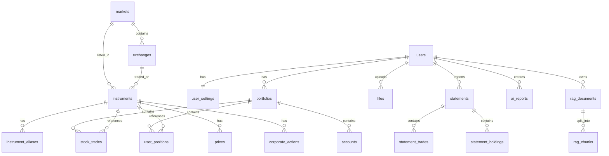

# 資料庫設計

> 版本：v1.1（對應 `stock_project_v1_1_ddl.sql`）  
> 資料庫：PostgreSQL 15+ with pgvector

---

## 命名規範

- **Schema**：`app`（業務資料）、`vector`（向量資料）
- **表名**：snake_case，名詞複數（如 `users`、`stock_trades`）
- **欄位名**：snake_case，明確語意
- **時間**：一律使用 `TIMESTAMPTZ`，存儲 **UTC**
- **日期**：使用 `DATE`，存儲 **西元日期**（民國日期在匯入時轉換）
- **金額/數量**：`NUMERIC(20, 6)` 或 `NUMERIC(20, 8)`（避免浮點誤差）
- **狀態/類型**：使用 `TEXT` + `CHECK` 約束，存儲字串 code（不用 enum ordinal）
- **主鍵**：`BIGINT GENERATED ALWAYS AS IDENTITY`
- **外鍵**：使用 `ON DELETE CASCADE` 或 `ON DELETE RESTRICT`（依資料關聯性）
- **審計欄位**：`created_at`、`updated_at`（使用 trigger 自動更新）

---

## ERD / Table 概覽



---

## 核心表（users / trades / positions）

### app.users
| 欄位 | 類型 | 說明 |
|------|------|------|
| id | BIGINT PK | 主鍵 |
| email | TEXT UNIQUE | 電子郵件 |
| google_sub | TEXT UNIQUE | Google OAuth subject ID |
| display_name | TEXT | 顯示名稱 |
| picture_url | TEXT | Google 頭像 URL |
| status | TEXT | 狀態：ACTIVE/SUSPENDED/PENDING |
| last_login_at | TIMESTAMPTZ | 最後登入時間 |
| created_at | TIMESTAMPTZ | 建立時間 |
| updated_at | TIMESTAMPTZ | 更新時間 |

### app.user_settings
| 欄位 | 類型 | 說明 |
|------|------|------|
| user_id | BIGINT PK FK | 使用者 ID |
| base_currency | CHAR(3) | 基準幣別（預設 TWD） |
| display_timezone | TEXT | 顯示時區（預設 Asia/Taipei） |

### app.portfolios
| 欄位 | 類型 | 說明 |
|------|------|------|
| id | BIGINT PK | 主鍵 |
| user_id | BIGINT FK | 使用者 ID |
| name | TEXT | 投資組合名稱 |
| base_currency | CHAR(3) | 基準幣別 |

### app.stock_trades
| 欄位 | 類型 | 說明 |
|------|------|------|
| id | BIGINT PK | 主鍵 |
| user_id | BIGINT FK | 使用者 ID |
| portfolio_id | BIGINT FK | 投資組合 ID |
| account_id | BIGINT FK | 券商帳戶 ID（可選） |
| instrument_id | BIGINT FK | 商品 ID |
| trade_date | DATE | 交易日期（西元） |
| settlement_date | DATE | 交割日期（可選） |
| side | TEXT | 買賣方向：BUY/SELL |
| quantity | NUMERIC(20,6) | 數量 |
| price | NUMERIC(20,8) | 單價 |
| currency | CHAR(3) | 幣別 |
| gross_amount | NUMERIC(20,6) | 交易總額 |
| fee | NUMERIC(20,6) | 手續費 |
| tax | NUMERIC(20,6) | 稅金 |
| net_amount | NUMERIC(20,6) | 淨額 |
| source | TEXT | 來源：OCR/MANUAL/API/MIGRATION |
| source_ref_id | BIGINT | 來源參照 ID |
| row_hash | CHAR(64) UNIQUE | SHA256 去重雜湊 |

### app.user_positions
| 欄位 | 類型 | 說明 |
|------|------|------|
| portfolio_id | BIGINT PK FK | 投資組合 ID |
| instrument_id | BIGINT PK FK | 商品 ID |
| total_quantity | NUMERIC(20,6) | 總持股數量 |
| avg_cost_native | NUMERIC(20,8) | 加權平均成本 |
| currency | CHAR(3) | 成本幣別 |
| updated_at | TIMESTAMPTZ | 更新時間 |

---

## 多市場主檔（markets / instruments）

### app.markets
| 欄位 | 類型 | 說明 |
|------|------|------|
| id | BIGINT PK | 主鍵 |
| code | TEXT UNIQUE | 市場代碼：TW/US |
| name | TEXT | 市場名稱 |
| timezone | TEXT | 市場時區 |
| default_currency | CHAR(3) | 預設幣別 |

### app.exchanges
| 欄位 | 類型 | 說明 |
|------|------|------|
| id | BIGINT PK | 主鍵 |
| market_id | BIGINT FK | 市場 ID |
| mic | TEXT | 交易所代碼（MIC） |
| code | TEXT | 簡稱（可選） |
| name | TEXT | 交易所名稱 |

### app.instruments
| 欄位 | 類型 | 說明 |
|------|------|------|
| id | BIGINT PK | 主鍵 |
| market_id | BIGINT FK | 市場 ID |
| exchange_id | BIGINT FK | 交易所 ID |
| ticker | TEXT | 股票代號（如 AAPL、2330） |
| symbol_key | TEXT UNIQUE | 唯一識別碼（如 US:XNAS:AAPL） |
| name_zh | TEXT | 中文名稱 |
| name_en | TEXT | 英文名稱 |
| currency | CHAR(3) | 交易幣別 |
| status | TEXT | 狀態：ACTIVE/DELISTED/SUSPENDED |

### app.instrument_aliases
| 欄位 | 類型 | 說明 |
|------|------|------|
| id | BIGINT PK | 主鍵 |
| instrument_id | BIGINT FK | 商品 ID |
| source | TEXT | 別名來源：OCR/MANUAL/DATA_VENDOR |
| alias_ticker | TEXT | 別名（如 BRK-B 對應 BRK.B） |

---

## 行情與匯率（prices / fx_rates）

### app.prices
| 欄位 | 類型 | 說明 |
|------|------|------|
| instrument_id | BIGINT PK FK | 商品 ID |
| time_interval | TEXT PK | 時間週期：1m/5m/15m/1h/1d/1w/1mo |
| ts_utc | TIMESTAMPTZ PK | 時間戳（UTC） |
| open | NUMERIC(20,8) | 開盤價 |
| high | NUMERIC(20,8) | 最高價 |
| low | NUMERIC(20,8) | 最低價 |
| close | NUMERIC(20,8) | 收盤價 |
| volume | NUMERIC(24,6) | 成交量 |
| source | TEXT | 資料來源（yahoo/fugle/...） |

### app.fx_rates
| 欄位 | 類型 | 說明 |
|------|------|------|
| base_currency | CHAR(3) PK | 基準幣別 |
| quote_currency | CHAR(3) PK | 報價幣別 |
| ts_utc | TIMESTAMPTZ PK | 時間戳（UTC） |
| rate | NUMERIC(20,8) | 匯率 |

---

## OCR staging（jobs / statements）

### app.files
| 欄位 | 類型 | 說明 |
|------|------|------|
| id | BIGINT PK | 主鍵 |
| user_id | BIGINT FK | 使用者 ID |
| provider | TEXT | 儲存供應商：local/s3/minio |
| bucket | TEXT | 儲存桶（可選） |
| object_key | TEXT | 物件鍵 |
| sha256 | CHAR(64) UNIQUE | 檔案雜湊（去重） |
| size_bytes | BIGINT | 檔案大小 |
| content_type | TEXT | MIME 類型 |

### app.ocr_jobs
| 欄位 | 類型 | 說明 |
|------|------|------|
| id | BIGINT PK | 主鍵 |
| user_id | BIGINT FK | 使用者 ID |
| file_id | BIGINT FK | 檔案 ID |
| statement_id | BIGINT FK | 對應的 statement ID |
| status | TEXT | 狀態：QUEUED/RUNNING/FAILED/DONE |
| progress | INT | 進度（0-100） |
| error_message | TEXT | 錯誤訊息 |

### app.statements（匯入批次）
| 欄位 | 類型 | 說明 |
|------|------|------|
| id | BIGINT PK | 主鍵 |
| user_id | BIGINT FK | 使用者 ID |
| portfolio_id | BIGINT FK | 投資組合 ID |
| source | TEXT | 來源：OCR/MANUAL |
| file_id | BIGINT FK | 檔案 ID（OCR 才有） |
| status | TEXT | 狀態：DRAFT/REVIEWED/CONFIRMED/FAILED |
| period_start | DATE | 對帳單起始日 |
| period_end | DATE | 對帳單結束日 |
| raw_text | TEXT | OCR 原始文字 |
| parsed_json | JSONB | 解析結果 JSON |

### app.statement_trades（交易草稿）
| 欄位 | 類型 | 說明 |
|------|------|------|
| id | BIGINT PK | 主鍵 |
| statement_id | BIGINT FK | 所屬 statement |
| instrument_id | BIGINT FK | 對應商品（解析後） |
| raw_ticker | TEXT | 原始股票代號 |
| trade_date | DATE | 交易日期 |
| side | TEXT | 買賣方向 |
| quantity | NUMERIC | 數量 |
| price | NUMERIC | 價格 |
| currency | CHAR(3) | 幣別 |
| fee | NUMERIC | 手續費 |
| tax | NUMERIC | 稅金 |
| row_hash | CHAR(64) | 列雜湊（去重） |
| errors_json | JSONB | 錯誤列表 |
| warnings_json | JSONB | 警告列表 |

---

## AI/RAG（reports / vectors）

### app.ai_reports
| 欄位 | 類型 | 說明 |
|------|------|------|
| id | BIGINT PK | 主鍵 |
| user_id | BIGINT FK | 使用者 ID |
| instrument_id | BIGINT FK | 相關商品（可選） |
| input_summary | JSONB | 輸入摘要 |
| output_text | TEXT | AI 生成內容 |
| created_at | TIMESTAMPTZ | 建立時間 |

### vector.rag_documents
| 欄位 | 類型 | 說明 |
|------|------|------|
| id | BIGINT PK | 主鍵 |
| user_id | BIGINT FK | 使用者 ID（資料隔離） |
| source_type | TEXT | 來源類型：NOTE/REPORT/FILE/WEB |
| source_id | TEXT | 外部來源 ID |
| title | TEXT | 文件標題 |
| meta | JSONB | 元資料 |

### vector.rag_chunks
| 欄位 | 類型 | 說明 |
|------|------|------|
| id | BIGINT PK | 主鍵 |
| document_id | BIGINT FK | 所屬文件 |
| user_id | BIGINT FK | 使用者 ID（冗餘，提升查詢效率） |
| chunk_index | INT | 區塊索引 |
| content | TEXT | 區塊內容 |
| embedding | vector(1536) | 向量嵌入 |
| meta | JSONB | 元資料 |

---

## 索引與效能

### 唯一索引
- `users(email)` UNIQUE
- `users(google_sub)` UNIQUE
- `instruments(symbol_key)` UNIQUE
- `instrument_aliases(source, alias_ticker)` UNIQUE
- `prices(instrument_id, time_interval, ts_utc)` PRIMARY KEY
- `fx_rates(base_currency, quote_currency, ts_utc)` PRIMARY KEY
- `stock_trades(row_hash)` UNIQUE
- `statement_trades(statement_id, row_hash)` UNIQUE
- `rag_chunks(document_id, chunk_index)` UNIQUE

### 查詢索引
- `portfolios(user_id)`
- `stock_trades(portfolio_id, trade_date DESC)`
- `stock_trades(instrument_id, trade_date DESC)`
- `user_positions(instrument_id)`
- `files(user_id, created_at DESC)`
- `statements(user_id, created_at DESC)`
- `ai_reports(user_id, created_at DESC)`
- `rag_documents(user_id)`
- `rag_chunks(user_id)` — 用於向量檢索時過濾

### 向量索引
- `rag_chunks(embedding)` USING ivfflat (vector_cosine_ops) WITH (lists = 100)
- 建議資料量大時改用 HNSW 索引

---

## Migration 規則

1. **Migration 工具**：使用 Flyway 管理 DDL 版本
2. **檔案命名**：`V{version}__{description}.sql`（如 `V1__init_schema.sql`）
3. **向下相容**：避免刪除欄位，優先使用 `ADD COLUMN IF NOT EXISTS`
4. **資料遷移**：大型資料遷移應分批執行，避免長時間鎖表
5. **索引建立**：使用 `CONCURRENTLY` 避免阻塞生產環境
6. **時間格式**：所有時間轉換為 UTC 後再入庫
7. **民國日期**：匯入層負責轉換，DB 只存西元日期

---

## 資料流落表

### 交易匯入流程
```
Upload → files
    ↓
OCR Job → ocr_jobs (QUEUED → RUNNING)
    ↓
Parse → statements (DRAFT) + statement_trades
    ↓
Review → 使用者修改 statement_trades
    ↓
Confirm → statements (CONFIRMED)
    ↓
    ├─→ stock_trades（正式交易）
    └─→ user_positions（更新持倉）
```

### RAG Ingestion 流程
```
Upload/Create → files / 文字輸入
    ↓
Chunking → 文字分割
    ↓
Embedding → 呼叫 Embedding API
    ↓
Store → rag_documents + rag_chunks（含 user_id）
    ↓
Query → 向量檢索 + user_id 過濾 → citations
```
