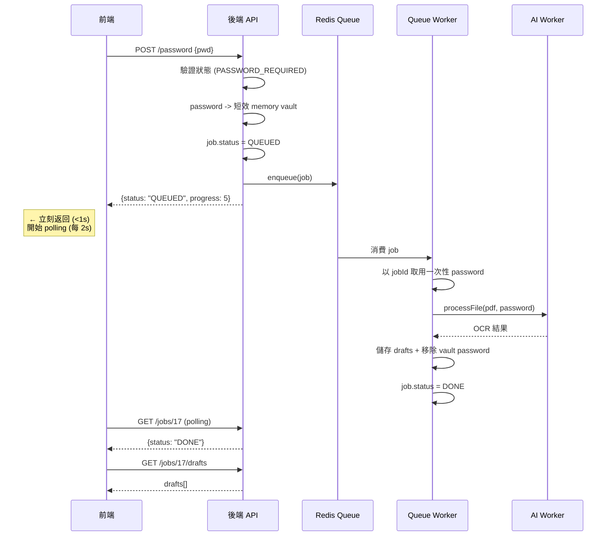

# OCR 匯入流程

> 狀態：已實作；2026-06-05 更新 AI Worker PDF OCR 解析策略。

## 核心流程 (Pipeline)

本系統採用 **非同步佇列** 架構處理 OCR 任務，確保高併發下的穩定性。

1. **上傳 (Upload)**: 使用者上傳 PDF/Image，計算 **SHA-256**。
2. **去重 (Dedupe)**: 檢查 SHA-256 是否已存在。若 `force=false` 且存在，直接回傳舊 Job ID；若 `force=true`，則建立新 Job。
3. **排程 (Enqueue)**: 建立 `OcrJob` (QUEUED) 與 `Statement` (DRAFT)，將 Job 推送至 Redis Stream (`ocr:jobs`)。
4. **解析 (Processing)**: **AI Worker** (Python) 透過 Redis Group 消費訊息，優先使用 PDF 文字層與規則解析器產生交易草稿；只有文字層/規則解析不足時才使用 Vision LLM / Text LLM 備援。若遇到加密 PDF，會將狀態標記為 `PASSWORD_REQUIRED` 等待使用者輸入。
5. **回寫 (Callback/Result)**: 解析結果 (JSON) 寫回 `app.statements`，並將交易明細轉存至 `app.statement_trades` (草稿表)。狀態更新為 `DONE`。

### 密碼解鎖流程 (Password Unlock Flow)

遇到加密 PDF 時，前端會提示使用者輸入密碼，並透過非同步佇列重新排程解析任務。



## AI Worker 解析策略（2026-06-05 更新）

本次修正後，OCR 不再以 Gemini parser 作為主要交易解析來源，而是改為 **deterministic parser first, LLM fallback**。

### 解析順序

```text
PDF 解密
  ↓
抽取 PDF 文字層（pypdf）
  ↓
逐頁分類
  ├─ 明顯總覽/說明頁：跳過 Vision
  ├─ 交易頁：保留文字層 + 補跑 Vision
  └─ 無文字層/不確定頁：跑 Vision
  ↓
合併 raw_text
  ↓
擷取「上市、上櫃、興櫃交易明細」到「上市/櫃(TWD)合計」區塊
  ↓
deterministic parser 候選解析
  ├─ Markdown table parser
  ├─ pipe table parser（無首尾 | 也支援）
  └─ vertical text-layer parser
  ↓
合計驗證（成交金額 / 手續費 / 代繳交易稅）
  ├─ 合計一致：直接產生 trades
  └─ 合計不一致：再嘗試 Gemini Text parser；失敗時回退規則解析並加 warning
```

### 支援的券商交易明細格式

1. **Markdown 表格**
   ```text
   | 2025/11/03 | 集中 | TWD | 買 | 2308 | 10 | 988.0000 | 9,880 | 8 | ... |
   | 2025/11/05 |      |     |    | 台達電 |    |          |       |   | ... |
   ```

2. **Pipe table（無首尾 `|`）**
   ```text
   2025/11/03 | 集中 | TWD | 買 | 2308 | 10 | 988.0000 | 9,880 | 8
   2025/11/05 |      |     |    | 台達電
   ```

3. **PDF 文字層直式區塊**
   ```text
   2025/11/03
   2025/11/05
   集中TWD買
   2308
   台達電
   10 988.0000 9,880 8
   ```

上述格式都會把一筆交易拆成的「成交日 / 交割日 / 市場幣別買賣 / 代號 / 名稱 / 數量價格」合併成單一 `ParsedTrade`。

### 完整性驗證

- 從合計行擷取：
  - `成交金額`
  - `手續費`
  - `代繳交易稅`
- 將解析出的 trades 加總後比對合計。
- 若合計一致，直接回傳 deterministic parser 結果，不再呼叫 Gemini parser。
- 若合計不一致，保留解析結果但加入 warning，並讓 LLM parser 有機會補救。
- 庫存明細區塊（例如 `上市、上櫃、興櫃庫存明細`）不得被解析成交易。

### 本次修正解決的問題

- 加密 PDF 可在輸入密碼後正確走 queue 非同步處理，避免前端 15 秒 timeout。
- 多頁 PDF 不再合併成超長圖片，避免 Vision 只讀到帳戶總覽。
- 交易頁會保留 PDF 文字層，不會被 Vision 截斷結果覆蓋。
- Gemini parser JSON 壞掉時，不再導致 `trades=[]`。
- 元大月對帳單可解析：
  - 一筆交易拆兩列的表格格式。
  - 無首尾 `|` 的 pipe table。
  - PDF 文字層直式格式。
  - `00965` ETF / `737362` 權證等非四碼代號。
  - 賣出列的交易稅。

### 觀測 log

成功路徑應可在 AI Worker log 看到：

```text
PDF text layer extracted
PDF page text layer used
All PDF pages processed ... text_layer_pages=...
Broker statement table fallback used
OCR completed trades_count=...
```

若最後又出現 Gemini `generateContent` parser call，通常代表 deterministic parser 沒有合計一致，需要檢查 raw_text 格式或補 parser 規則。

## Draft→Review→Confirm 機制

為了確保帳務正確，OCR 結果**不會直接匯入**正式交易紀錄，而是強制經過「檢視與確認」流程。

1. **Draft (草稿)**:
   - 解析後的資料存於 `statement_trades` 表。
   - 狀態：`DRAFT` (Statement)。
   - 使用者可在此階段修改內容（如修正錯誤的識別結果）或刪除單筆草稿。

2. **Review (檢視)**:
   - 前端顯示草稿列表，標示 **Warnings** (如：疑似重複交易、交割日早於成交日)。
   - 系統自動計算 `row_hash` 以識別草稿變更。
   - 草稿驗證採 **Validator Chain**，規則可擴充且不會讓 `saveDrafts` 持續膨脹。

3. **Confirm (確認匯入)**:
   - API: `POST /api/ocr/jobs/{jobId}/confirm`
   - 支援 **部分匯入**：使用者可勾選特定草稿匯入。
   - **驗證邏輯**:
     - 檢查 `instrumentId` 是否有效。
     - 檢查 **重複交易** (Duplicate Check)：比對 `stock_trades` 是否已有相同 (Portfolio, Instrument, Date, Side, Qty, Price) 的紀錄。
   - **匯入動作**:
     - 將草稿轉為 `TradeCommand`，寫入 `stock_trades` (正式表) 與 `user_positions` (庫存表)。
     - **匯入成功後，物理刪除對應的草稿**。
   - **完成判定**:
     - 當該 Statement 下的所有草稿都已處理 (匯入或刪除) 完畢，Statement 狀態更新為 `CONFIRMED`。

## 重新解析 (Reparse) 與版本控制

- API: `POST /api/ocr/jobs/{jobId}/reparse`
- 行為：
  1. 將目前的 Statement 標記為 **SUPERSEDED** (已過時)，並記錄 `superseded_at`。
  2. 建立 **全新** 的 Statement (DRAFT) 與 Job (QUEUED)。
  3. 重新執行完整的 OCR 流程。
- 目的：保留歷史紀錄 (Audit Trail)，同時允許使用者針對同一檔案使用不同參數或新版 Prompt 重新解析。

## 錯誤處理與重試

- **Job Timeout**: `OcrService` 檢查 `maxRunningMinutes` (預設 30分)，若 Job 卡在 `RUNNING` 過久，視為失敗。
- **存活檢查**: 若發現舊 Job 為 `FAILED` 或意外卡在 `QUEUED`，再次上傳相同檔案時，會自動重置狀態並重新 Enqueue。
- **Queue 自我修復**:
  - Consumer Group 初始化僅在成功（或 `BUSYGROUP` 已存在）時標記 ready。
  - `readBatch/readPending` 遇到 `NOGROUP` 會重置狀態、重建 Group 並重試一次。
- **AI Worker 重試**: AI Worker 端針對 LLM Rate Limit 實作了指數退避 (Exponential Backoff) 重試機制。

## 資料落表設計

| 階段 | 表格 | 說明 |
|------|------|------|
| 原始檔 | `app.files` | 存放實體檔案路徑與雜湊值 |
| 任務 | `app.ocr_jobs` | 追蹤進度、狀態、錯誤訊息 |
| 批次 | `app.statements` | 匯入批次，存放 OCR raw_text / parsed_json |
| 草稿 | `app.statement_trades` | 待確認的交易，含警告/錯誤資訊 |
| 正式 | `app.stock_trades` | 確認後的正式交易紀錄 |
